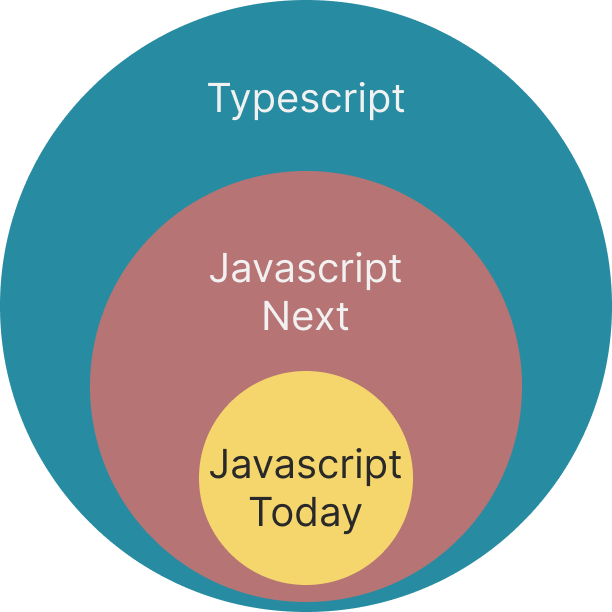
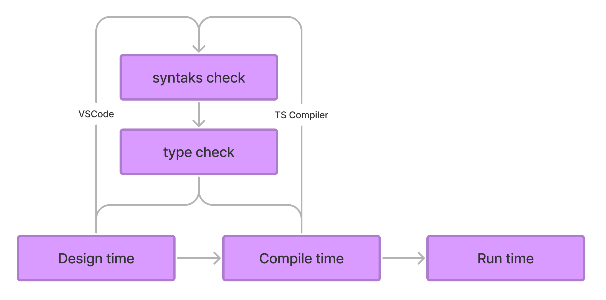

# SU070 Typescript/Javascript

---
## Introduction

 - Meet and greet
 - Setting expectations

---
## Overview

  - Day 1: Javascript/Ecmascript
  - Day 2: Typescript
  - Day 3: Project and recap of day 1 and 2

---
## Bookmarks (1/2)

- Official documentation: [typescriptlang.org](https://www.typescriptlang.org/docs/)
- Typescript Deep Dive: [basarat.gitbook.io/typescript](https://basarat.gitbook.io/typescript/)
- Typescript Playground: [typescriptlang.org/play](https://www.typescriptlang.org/play)
- Code Sandbox [codesandbox.io](https://codesandbox.io/)
- Can I use [caniuse.com](https://caniuse.com/)

---

## Bookmarks (2/2)

- Web Dev Simplified: [https://www.youtube.com/@WebDevSimplified](https://www.youtube.com/@WebDevSimplified)
- Typescript Simplified: [https://learn.webdevsimplified.com/typescript-simplified-course](https://learn.webdevsimplified.com/typescript-simplified-course)]
- Jack Herrington [Youtube channel](https://www.youtube.com/watch?v=j92fxPpFaL8&list=PLNqp92_EXZBIKO8lqN3089jgZUi-FUFXX)
- Matt Pocock: [youtube.com/@mattpocockuk](https://www.youtube.com/@mattpocockuk)
- Total Typescript: [totaltypescript.com](https://www.totaltypescript.com)


---
## What is Javascript/Ecmascript?

- Born in the browser
- Dynamically typed (run-time)
- Interpreted
- Functional and object-oriented
- Event-driven
- Constrained by browser compatibility

---
## Timeline

- 1997: Ecmascript
- ES4 dropped
- 2009: ES5
- 2009: First release of Node.js
- 2015: ES6 - "Next generation javascript"
- 2016-2022: [Continuous annual releases](https://en.wikipedia.org/wiki/ECMAScript_version_history): ES7, ES8, ES9, ES10, ES11, ES12, ES13, ES14, ES15, ES16

---
## What is Typescript?

- Superset of Javascript
- Statically typed (compile-time)

--- { "layout": "center"}
## Superset of Javascript

---
## Statically typed

This is ok:

```typescript
let x:number = 1;
const multiplyByTwo = (x:number) => {
  return x * 2;
}
```

This will fail:

```typescript
let x:string = "1";
const multiplyByTwo = (x:number) => {
  return x * 2;
}
```
--- { "layout": "center"}
## Compilation 1/2


---
## Compilation 2/2

- Design time
  - Editing the project in VSCode
- Compile time
  - The project is converted to Javascript
- Run time
  - The project runs as Javascript in the browser or Node.js
  - Note: Typescript types do not exist at runtime

---
## Why Typescript?

- Confidence
- Fast feedback loops 
  - Design time errors
    - Feedback in editor > "Fail fast"
  - Compile time errors
- Less need for validation logic and fewer unit tests
- Future javascript now

---
## Toolbox

- Install NPM and Node.JS
- Install Yarn
- Install Vite
- Install VSCode

---
## NPM 1/2

NPM is responsible for package management in Javascript. We use NPM to install and manage dependencies. Make sure you have Node.js (minimum v.24.x) installed.

[Download Node.js](https://nodejs.org/en/download/)

---
## NPM 2/2

On Linux/Unix/Mac you can use a package manager to install Node.js:
- Mac: [HomeBrew](https://brew.sh/)
- Linux: [APT](https://ubuntu.com/server/docs/package-management)

On Windows I recommend using WSL to get a Linux-like environment.

---
# Yarn

- Yarn is a "layer" on top of NPM that offers some improvements in terms of e.g. performance.
- Yarn is not a requirement, but code examples in the course will be based on Yarn, as Yarn has moved towards becoming the new industry standard for Javascript development.

Install Yarn globally:

```bash
$ npm install yarn --global
```
---
# Vite

- Development server (no build required, hot module replacement)
- Bundler
- Simple configuration compared with Webpack or older tools like Grunt and Gulp

Setup a new project (Vanilla, React, Angular, Svelte, etc.)

```bash
$ npm create vite@latest
```


---
# VSCode

VSCode is not a requirement (you can e.g. use WebStorm, or terminal/VIM), BUT...
- VSCode is "widely accepted" as the best code editor and IDE
- Good Typescript support
- Runs on all platforms (and in the browser with Github Codespaces)

Therefore the course is based on using VSCode.

[Download VSCode](https://code.visualstudio.com/download)

---
## Break

---
## Javascript syntax

In the following section we go through basic Javascript syntax.

Since Typescript is a superset of Javascript, everything we learn here is also valid Typescript.

---
## Variables

You can use different keywords `var`, `let` and `const` to define a variable.

```typescript
var a = "Jens";
console.log(a); // "Jens"
let b = "Børge";
console.log(b); // "Børge"
const c = "Hansen";
console.log(c); // "Hansen"
```

---
## Variables - re-assignment

If you use `var` or `let` you can change the value of the variable later in the code:

```javascript
let a = "Jens";
let b = "Hansen";
b = "Jensen";
console.log(a + " " + b); // "Jens Jensen"
```

---
## Variables - constant values

If you use `const` you cannot change the value of the variable later:

```javascript
const a = "Jens";
const b = "Hansen";
b = "Jensen"; // Fejl
```

---
## Variables - difference between `var` and `let`

`var` is function scoped. `let` is block scoped.

```javascript
function run() {
  var foo = "Foo";
  let bar = "Bar";
  console.log(foo, bar); // Foo Bar
  {
    var moo = "Mooo"
    let baz = "Bazz";
    console.log(moo, baz); // Mooo Bazz
  }
  console.log(moo); // Mooo
  console.log(baz); // ReferenceError
}
run();
```

---
## Variables without keyword

If you declare a variable without a keyword it is automatically added to the global scope. This is bad practice and should be avoided, as you risk overwriting other variables in the global scope - e.g. from a library you might have loaded.

```javascript
// Gør aldrig dette
a = "Jens"; // Implicit global
// Skal du bruge en global variabel, så gør det eksplicit med window:
window.a = "Jens"; // Explicit global
```

---
## Variables - best practice

- Use `const` as often as possible. It is more predictable.
- Use `let` if you need to change the value of the variable later in the code.
- Avoid using `var` unless you are writing code that needs to support ES5, as function scope is confusing for developers with a background in other languages and is the cause of many bugs.
- Never use variables declared without a keyword (implicit globals)

---
## Dynamic types

Javascript is a dynamic language, which means you do not need to define the data type of a variable.

The data type is automatically determined by the value:

```javascript
"Jens" // string
42 // number
true // boolean
```

---
## Primitive data types in Javascript

Javascript has 7 primitive data types:

```javascript
"Jens" // string
42 // number
true // boolean
null // null
undefined // undefined
Symbol("foo") // symbol
BigInt(9007199254740991) // bigint
```

---
## Strings
A `string` is a text string. And can be defined with single or double quotes.

```javascript
"Jens"
'Peter'
'Streng der indeholder "dobbelte" anførselstegn';
"Streng der indeholder 'enkelte' anførselsetegn.";
```

---
## Concatenated strings

```javascript
const samlet = "Jens" + " " + "Peter"; // "Jens Peter"
const matematik = "1" + "2"; // "12"
```
---
## Template literals
- Uses backticks ` instead of quotes.
- Special syntax for inserting variables into the string.

```javascript
const firstName = "Jens";
const lastName = "Hansen";
const samlet = `${firstName} ${lastName}`; // "Jens Hansen"
const samlet2 = `Mit navn er ${firstName} ${lastName} og jeg bor i Odder.`; // "Mit navn er Jens Hansen og jeg bor i Odder."
```

---
## Exercise

String assignment and template literals:
```js
export let firstname, lastname, fullname;
```


1. Assign the first name to "Michael"
2. Assign the last name to "Madsen"
3. First use the "+" operator to join the first and last name.
4. Then rewrite the statement to use template literals
---
## Break

---
## Numbers in javascript

- Unlike other programming languages, the type `number` is used for both integers and decimals.
- BigInt can be used to represent integers larger than 2^53 - 1.

--- { "layout": "center"}
## Arithmetic

| Operator | Description    |
|----------|----------------|
| +        | Addition       |
| \-       | Subtraction    |
| \*       | Multiplication |
| \*\*     | Exponentiation |
| /        | Division       |
| %        | Modulus (remainder) |
| ++       | Increment      |
| \--      | Decrement      |

---
## Arithmetic (examples)

```
1 + 2 // => 3 (Addition)
7 - 2 // => 5 (Subtraction)
2 * 2 // => 4 (Multiplication)
2 ** 3 // => 8 (Exponentiation)
2 / 2 // => 1 (Division)
3 % 2 // => 1 (Modulus/rest)
let a = 1; a++; // => 2 (Increment)
let b = 10; b--; // => 9 (Decrement)
```

---

# Exercise: Arithmetic and operators:

--- { "layout": "columns"}


::section

1. What is the result of 5 + 3?
2. What is the result of 7 + (-2)?
3. What is the result of 8 - 4?
4. What is the result of 12 - (-5)?
5. What is the result of 3 * 4?

::section

6. What is the result of (-2) * 5?
7. What is the result of 10 / 2?
8. What is the result of (-8) / 4?
--- { "layout": "columns"}

::section

9. What is the result of 7 % 3?
10. What is the result of -10 % 3?
11. What is the result of 2 ** 3?
12. What is the result of (-2) ** 3?

::section

13. What is the result of x = 5; x++;
14. What is the result of y = -7; y++;
15. What is the result of x = 10; x--;
16. What is the result of y = -5; y--;
---
## Converting strings to numbers 1/3

If you already know a string contains a number you can convert it to a number with `Number()`, `parseInt()` or `parseFloat()`.

`parseInt()` returns the first integer it finds in the string:

```javascript
parseInt("32px") // 32
```

---
## Converting strings to numbers 2/3

`parseFloat()` returns the first decimal number it finds in the string:

```javascript
parseFloat("32.2px") // 32.2
```

---

## Converting strings to numbers 3/3

`Number()` attempts to convert the entire string to a number:

```javascript
Number("32") // 32
Number("32.2") // 32.2
Number("32px") // NaN
```

---
## Equality

- Loosely equal: `==`
  - Javascript converts the values to the same type before comparison.
- Strictly equal: `===`
  - Javascript compares the values without conversion.

[MDN: Equality comparisons and sameness](https://developer.mozilla.org/en-US/docs/Web/JavaScript/Equality_comparisons_and_sameness)

---
## Control structures - if

```typescript
if (x = 1) {
  /* Hvis user input er 1 */
  return 'a';
}
```

```typescript
if (userInput % 2) {
  /* Hvis user input er ulige */
  return 'a';
}
```

---
## Control structures - if/else

```typescript
if (userInput % 2) {
  /* Hvis user input er ulige */
  return 'a';
} else {
  /* Hvis user input er lige */
  return 'b';
}
```
---
## Ternary operator

Same principle as `if/else` but on one line:

```typescript
const result = userInput % 2 ? 'a' : 'b';
```
---
## AND/OR

AND:

```typescript
return a && b;
```

OR:

```typescript
return a || b;
```

---
## Nullish coalescing operator

```typescript
let accountAmount = 0;
return accountAmount || 'No account found'; // 'No account found'
...
let accountAmount = 0;
return accountAmount ?? 'No account found'; // 0
```

[Video by Web Dev Simplified](https://youtu.be/v2tJ3nzXh8I?t=41)

---
## Break

---
## Iteration - loops

- Loops (iterators) are used when you want to repeat a piece of code multiple times.
- There are 3 different types of loops in javascript:
  - `for`
  - `while`
  - `do while`

---
## For loop

```typescript
for (let i = 0; i < 10; i++) {
  console.log(i); // 0, 1, 2, 3, 4, 5, 6, 7, 8, 9
}
```

---
## While loop

```typescript
let i = 0;
while (i < 10) {
  console.log(i); // 0, 1, 2, 3, 4, 5, 6, 7, 8, 9
  i++;
}
```

---
## do...while loop

```typescript
let i = 0;
do {
  console.log(i); // 0, 1, 2, 3, 4, 5, 6, 7, 8, 9
  i++;
} while (i < 10);
```

---
## Exercise - iterators

1. Create a for loop that uses console.log to print all even numbers between 0-10
2. Declare a variable "sum". Create a while loop that counts from 0-50 and each time the loop runs, the current number is added to sum.
3. Rewrite exercise 2 as a do...while loop

---
## Break

---
## Objects

A javascript object is an entity that defines properties and data.

Example:

```javascript
let person = {
  name: "John Doe",
  age: 30,
  occupation: "Software Developer",
};
```

---
## Nested objects

A javascript object can contain nested objects:

```javascript
let person = {
  name: "John Doe",
  age: 30,
  occupation: "Software Developer",
  address: {
    street: "123 Main St",
    city: "Anytown",
    state: "CA",
    zip: "12345"
  },
};
```

---
## Accessing object values

You can access object values in two ways:

```javascript
  // Dot notation
  const name = person.name;
  // Bracket notation
  const name = person["name"];
  // Nestede værdier
  const street = person.address.street;
```

---
## Object destructuring

You can use object destructuring as a shortcut to create a new variable and assign it a value from an object at the same time. You "pluck" the value out of the object:

```javascript
  const { name } = person;
  console.log(name); // "John Doe"
  // Eller flere værdier på samme tid:
  const { name, age, occupation } = person;
  console.log(name, age, occupation); // "John Doe", 30, "Software Developer"
```

---
## Arrays

A javascript array is a list of values.

```javascript
  const list = [1, 2, 3, 4, 5];
```

In javascript an array can contain values of different types:

```javascript
  const list = [1, "to", { id: 3} , 4, "5"];
```

---
## Array destructuring

Just like objects you can use destructuring with arrays:

```javascript
  const list = [1, 2, 3 , 4, 5];
  const [first, second, third] = list;
  console.log(first, second, third); // 1, 2, 3
```

---
## JSON

- JSON stands for JavaScript Object Notation
- Stored in a .json file
- Often used to save data to a file or to exchange data with an API

---
## JSON

JSON looks like a javascript object, but note that all values in JSON must be in double quotes:

```json
{
  "name": "John Doe",
  "age": "30",
  "occupation": "Software Developer",
  "address": {
    "street": "123 Main St",
    "city": "Anytown",
    "state": "CA",
    "zip": "12345"
  }
}
```

---
## JSON Parse

A json file can be imported in a javascript file and converted to an object with JSON.parse();

```javascript
import person from './person.json';
const obj = JSON.parse(person);
```

Likewise you can serialize an object to JSON with JSON.stringify():

```javascript
const obj = { name: "John Doe", age: 30 };
const jsontext = JSON.stringify(obj);
```

---
## Exercise

Objects and Arrays:

[](https://codesandbox.io/s/amazing-platform-zqfbng?fontsize=14&hidenavigation=1&theme=light)

---
## Break

---
## Functions

- Functions are one of the most important building blocks in javascript.
- A function is a sequence of instructions that is packaged as a unit and can be reused.
- A function is a block of code that performs a piece of work when it is called.
- A function can take parameters and return a value.
- A function can also modify values outside its own scope (side effects)

---
## Functions (syntax)

```typescript
function sum(a, b) { return a + b }
```

---
## The anatomy of a function 1/2

```typescript
function sum(a, b) { return a + b }
```

- Name: sum
- Parameters: a, b
- Return value: a + b

---
## The anatomy of a function 2/2

```typescript
function capitalize(input) {
  const output = input.toUpperCase();
  return output;
}
```

- Name: capitalize
- Parameters: input
- Return value: output

---
## Anonymous functions

Anonymous function:

```typescript
function(a, b) {return a + b }
```

Anonymous function with variable:

```typescript
const sum = function(a, b) {return a + b }
sum(1, 2); // 3
```

---
## Arrow function

```typescript
const capitalize = (input) => { return input.toUpperCase() }
```

If there is only one parameter, parentheses can be omitted:

```typescript
const capitalize = input => { return input.toUpperCase() }
```

If the function returns on one line, the block and return statement can be omitted:

```typescript
const capitalize = input => input.toUpperCase();
```


---
## Functions (3/3)

It is called a method when an object or class property has a function as its value:

```typescript
const someObject = {
  val: 123,
  callMe: (a) => { return % a }
}
const result = someObject.callMe(2);
```

---
## Functions - Default arguments

You can define default values for parameters:

```typescript
const sum = (a = 1, b = 2) => a + b;
sum(7,3) // 10
sum() // 3
```

---
## Hoisting

Works:

```typescript
doSomething(); 
function doSomething() { return "yes" }
```

Does not work:

```typescript
doSomethingElse(); 
const doSomethingElse = () => { return "yes" }
```

---
## Functions that return functions

```typescript
function calculator(operation) {
  if (operation === 'add') {
    return function(a, b) { return a + b; }
  } else if (operation === 'subtract') {
    return function (a, b) { return a - b };
  }
}
calculator('add)(1, 2); // 3
```

---
## Function that takes a function as a parameter

```typescript
function processWithCallback(x, y, callback) {
  const result = x * y;
  callback(result);
  return result;
}
process(3, 7, (a) => { console.log(a)})
process(5, 2, (a) => { persistToDatabase(a)})
```
---
## Exercise

Functions, objects and arrays

[](https://codesandbox.io/s/functions-with-objects-and-arrays-2vl0mi?fontsize=14&hidenavigation=1&theme=light)

---
## Break

---
## Guard clauses (1/2)

Without guard clause:

```typescript
function processRequest(paramA, paramB) {
  if (typeof paramA !== 'undefined' || typeof paramB !== 'undefined' ) {
    const result = paramA + paramB;
    return result;
  } else {
    return null;
  }
}
```

---
## Guard clauses (2/2)

With guard clause:

```typescript
function processRequest(paramA, paramB) {
  if (typeof paramA === 'undefined' || typeof paramB === 'undefined' ) {
    return null;
  }
  return paramA + paramB;
}
```

[Video by Web Dev Simplified](https://www.youtube.com/watch?v=EumXak7TyQ0)

---
## Spread syntax

"Expand" an array or an object into a list of arguments.

```typescript
function sum(x, y, z) {
  return x + y + z;
}
const numbers = [1, 2, 3];
console.log(sum(...numbers));
// Expected output: 6
console.log(sum.apply(null, numbers));
// Expected output: 6
```

---
## Copying an object or array with spread syntax

A very commonly used pattern is to copy an object or an array with spread syntax:

```typescript
  // Objekt
  const obj = { a: 1, b: 2, c: 3 };
  const obj2 = { ...obj };
  // Array
  const arr = [1, 2, 3];
  const arr2 = [...arr];
```

---
## Immutable objects and arrays

When striving for immutability it is important to copy the object each time you modify it:

```typescript
  // Objekt
  const obj = { a: 1, b: 2, c: 3 };
  const obj2 = { ...obj, a: 4 };
```

---
## Array Functions `Array.forEach()`

forEach executes a piece of code for each element in an array. Nothing is returned from forEach.

```typescript
const list = [1, 2, 3, 4, 5];
list.forEach((item) => { console.log(item) }); // 1, 2, 3, 4, 5
```


---
## Array Functions `Array.map()`

Map is similar to forEach, but differs by returning a new array with the modified values.

```typescript
const list = [1, 2, 3, 4, 5];
const newList = list.map((item) => { return item - 1 }); // [0, 1, 2, 3, 4]
```

---
## Array Functions `Array.find()`

Find returns the first element in an array that matches a given criteria.

```typescript
const list = [
  { id:1, name: 'first'},
  { id:2, name: 'second' }
];
const picked = list.find((item) => { return item.id === 2 });
console.log(picked); // { id:2, name: 'second' }
```

---
## Array Functions `Array.filter()`

Filter returns a new array with all elements that match a given criteria.

```typescript
const list = [
  { id:1, name: 'first'},
  { id:2, name: 'second' },
  { id: 3, name: 'third' },
  { id: 4, name: 'fourth' },
  { id: 5, name: 'fifth' }
];
const picked = list.filter((item) => { item.id > 3 });
console.log(picked); // [{ id: 4, name: 'fourth' }, { id: 5, name: 'fifth' }]
```

---
## Array Functions `Array.reduce()`

Reduce reduces an array to a single value.

```typescript
const dates = [
  new Date('2020-03-04'),
  new Date('2018-04-03'),
  new Date('2022-01-01'),
  new Date('2020-05-06'),
  new Date('2021-02-01')
];
const latestDate = dates.reduce((latest, current) => {
  return current > latest ? current : latest;
});
```


---
## Array methods and objects

You cannot use Array methods on objects, but you can convert objects to arrays with `Object.entries`.

```typescript
const timesheetByName = {
  michael: { hours: "237"},
  john: { hours: "252"},
  jane: { hours: "212"},
  michelle: { hours: "141"}
};
const timesheetEntries = Object.entries(timesheetByName);
const totalHours = timesheetEntries.reduce((sum, [key, value]) => {
  return sum + Number(value.hours);
}, 0);
```

---
## Optional chaining

Optional chaining allows you to avoid getting an error if an object or array is undefined. Example:

```typescript
const adventurer = {
  name: 'Alice',
  cat: {
    name: 'Dinah'
  }
};
const dogName = adventurer.dog?.name;
console.log(dogName);
// Expected output: undefined
console.log(adventurer.someNonExistentMethod?.());
// Expected output: undefined
```

---
## Rest parameters

Allows you to accept an unknown number of parameters as an array.

```typescript
function sum(...theArgs) {
  let total = 0;
  for (const arg of theArgs) {
    total += arg;
  }
  return total;
}
console.log(sum(1, 2, 3));
// Expected output: 6
console.log(sum(1, 2, 3, 4));
// Expected output: 10
```

---
## Promises
Promises are a way to handle asynchronicity. A promise can be in three different states:
- Pending
- Fulfilled
- Rejected

---
## Promises

Create a Promise:

```typescript
const myPromise = new Promise((resolve, reject) => {
  setTimeout(() => {
    resolve("foo");
  }, 300);
});
```

---
## Promises

```typescript
const handleFulfilled = (value) => {
  console.log(value);
};
const handleRejected = (error) => {
  console.log(error);
};
myPromise.then(handleFulfilled, handleRejected)
```


---
## Async / Await

```typescript
const run = async function() {
  const result = await myPromise();
  console.log(result);
}
run();
```

---
## Project

Build an SDK for a cinema

[](https://codesandbox.io/s/movie-exercise-0p20tb?fontsize=14&hidenavigation=1&theme=light)

---
## Exercise

Array functions

[](https://codesandbox.io/s/array-methods-dztykn?fontsize=14&hidenavigation=1&theme=light)


---

# TypeScript Course

---

# 1 - Setup

---

## 1.1 Introduction

- TypeScript = JavaScript + a static type system layered on top; all valid JS is valid TS
- TS is transpiled down to plain JS; the type system is erased at build time
- Course progression: core language → type modifiers → advanced types → utility types → narrowing → type-level programming → OOP → real-world patterns

---

- Goals:
  - Master every feature of the type system, from primitives to conditional/mapped types
  - Learn idiomatic, production-grade TS (not just syntax)
  - Build the muscle to read library types (React, tRPC, Zod, etc.)
  - Integrate TS with tooling: ESLint, bundlers, test runners, CI
- Who it's for: JS developers who want type safety; teams scaling codebases beyond what JSDoc can handle

---

- Value proposition:
  - Errors caught at compile time instead of 3 AM pager alerts
  - Self-documenting code — types are the first-class docs
  - Editor superpowers: autocomplete, rename, go-to-definition, extract refactor
  - Onboarding: new devs can hover over any symbol and learn the API
  - Safer refactors: change a type, get a list of every call site to fix

---
 
## 1.2 Installing TypeScript

- Global install (handy for one-offs): `npm install -g typescript`
- Per-project (preferred in real apps — pins the version):
```bash
npm install --save-dev typescript
```

---

- Binary is `tsc` — the TypeScript compiler
- Bootstrap a config: 
```bash
tsc --init
```
- Generates a commented `tsconfig.json`
- Compile a file: `tsc file.ts` → emits `file.js`
- Watch mode for dev loops: 
```bash
tsc --watch
```
- Type-check only (no emit — common in CI):
```bash
tsc --noEmit
```
---

## 1.3 tsconfig.json

- Central compiler config — describes files, targets, and strictness
---
- Key options and why they matter:
  - `target`: JS version to emit (`ES2020`, `ESNext`)
  - `module`: module format (`CommonJS`, `ESNext`)
  - `strict: true` — enables all strict flags
  - `noUncheckedIndexedAccess: true`
  - `outDir` / `rootDir` — where source lives
  - `include` / `exclude` — glob-based file selection
  - `lib` — ambient libraries available (`DOM`, `ES2020`, `WebWorker`)
  - `jsx` — JSX handling (`react-jsx` for modern React)
---
  - `esModuleInterop: true` — lets you `import x from "cjs-module"` cleanly
  - `skipLibCheck: true` — skip type-check of `node_modules` `.d.ts` (speeds up builds)
  - `paths` + `baseUrl` — path aliases like `@/components/*`
  - `declaration: true` — emits `.d.ts` files for library authors
---
- Example:
  ```json
  {
    "compilerOptions": {
      "target": "ES2022",
      "module": "ESNext",
      "strict": true,
      "noUncheckedIndexedAccess": true,
      "esModuleInterop": true,
      "skipLibCheck": true,
      "outDir": "./dist",
      "paths": { "@/*": ["./src/*"] }
    },
    "include": ["src"]
  }
  ```
---

- Enable strict mode from day one — retrofitting later is exponentially more painful

---

## 1.4 Running TypeScript

- `tsc` only transpiles — it doesn't run code
- Options to execute TS:
  - Compile then run: `tsc && node dist/index.js`
  - Run directly via `ts-node` (classic) or `tsx` (modern, faster)
  - Bundle with Vite / esbuild / swc — they strip types and bundle in one pass
  - Deno / Bun support TS natively, no extra setup
---
- For library authors: ship JS + `.d.ts` declaration files; consumers never see your `.ts`
- For apps: usually a bundler handles everything; 
- Source maps (`sourceMap: true`) let debuggers map emitted JS back to your TS

---

## 1.5 Editor & Tooling

- VS Code is the de-facto editor — TS is developed by the same team
- Essential features out of the box: hover types, go-to-def, find-all-refs, rename symbol, inline errors, code actions
- Pair TS with:
  - ESLint + `@typescript-eslint/parser` + `@typescript-eslint/eslint-plugin` for lint rules

---

  - Prettier for formatting (separate concern — doesn't type-check)
  - Husky + lint-staged to enforce `tsc --noEmit` and lint on commit
- Workspace TS vs bundled TS: use "TypeScript: Select Version" so every dev uses the project's pinned version
- CI gate: `tsc --noEmit` + `eslint .` + tests — no merges unless all three pass

---

# 2. Basic Types

---

## 2.1 Primitive Types

- Seven primitives: `string`, `number`, `boolean`, `null`, `undefined`, `symbol`, `bigint`
- Annotate explicitly when needed; otherwise let TS infer:
  ```typescript
  let name: string = "Mike";   // explicit
  let age = 30;                // inferred as number
  let isAdmin: boolean = true;
  ```
- Inference is usually the right default — annotate on function params, returns, and public APIs

---

- `any` — opts out of type checking entirely; silently accepts everything; avoid except as a last resort
- `unknown` — the "type-safe any"; must be narrowed before use:
  ```typescript
  function parse(input: unknown) {
    if (typeof input === "string") {
      return input.toUpperCase(); // narrowed to string
    }
  }
  ```
- `never` — bottom type; represents a value that can never exist (e.g. function that throws or infinite loops)
- `void` — function returns nothing meaningful; distinct from `undefined`

---

## 2.2 Arrays & Tuples

- Two array syntaxes (equivalent):
  ```typescript
  const nums: number[] = [1, 2, 3];
  const nums2: Array<number> = [1, 2, 3];
  ```
- Mixed arrays via unions: `(string | number)[]`

---

- Tuples — fixed length, fixed types per index:
```typescript
const pair: [string, number] = ["age", 30];
```
- Labeled tuples (improves hover docs):
```typescript
type RGB = [r: number, g: number, b: number];
```
- Rest in tuples: 
```typescript
type Args = [cmd: string, ...flags: string[]];
```

---

- Readonly arrays:
```typescript
const frozen: readonly number[] = [1, 2, 3];
// frozen.push(4); // Error: push doesn't exist on readonly
```
- `as const` — deeply freezes a literal into a readonly tuple of literal types:
```typescript
const COLORS = ["red", "green", "blue"] as const;
// type: readonly ["red", "green", "blue"]
type Color = typeof COLORS[number]; // "red" | "green" | "blue"
```

---

## 2.3 Objects

- Object shape inline:
```typescript
let user: { name: string; age: number } = { name: "Mike", age: 30 };
```
- Optional properties with `?`:
```typescript
type User = { name: string; age?: number };
```
- `readonly` on properties:
```typescript
type Point = { readonly x: number; readonly y: number };
```

---

- Excess property checks on object literals — catches typos:
```typescript
// Error: 'nmae' does not exist on type '{ name: string }'
const u: { name: string } = { nmae: "Mike" };
  ```
- Index signatures for dynamic keys:
```typescript
type Scores = { [player: string]: number };
```
- Combine fixed + index: 
```typescript
{
  total: number; // total must be present
  [month: string]: number // in addition, there can be other keys which must have number values
}
```

---

## 2.4 Type Aliases & Interfaces

- `type` alias — flexible, can alias anything:
```typescript
type ID = string | number;
type User = { name: string; id: ID };
```
- `interface` — describes object shapes; can be re-opened:
```typescript
interface User { name: string }
interface User { age: number } // declaration merging
// User now has both name and age
```

---

- Differences to remember:
  - `interface` can declare-merge (declare interface multiple times)
  - `type` can alias unions, primitives, tuples; `interface` cannot
  - Both support extension:
```typescript
interface Admin extends User { role: "admin" }
type Admin2 = User & { role: "admin" };
```

---

  - Error messages with `interface` are sometimes clearer
- Rule of thumb: `interface` for public object shapes (esp. in libraries), `type` for unions, intersections, mapped/conditional types

---

## 2.5 Literal & Union Types

- Literal types — a specific value as a type:
  ```typescript
  let dir: "up" | "down" | "left" | "right";
  let answer: 42;
  ```
- Unions — any one of several types:
  ```typescript
  type ID = string | number;
  type Status = "idle" | "loading" | "success" | "error";
  ```
- Great for state machines, enums without the `enum` keyword, variant modeling

---

## 2.5 Literal & Union Types

- Derive unions from runtime data with `as const`:

```typescript
const STATUSES = ["idle", "loading", "success", "error"] as const;
type Status = typeof STATUSES[number]; // literal union
```

---

# 3 Function Types

---

## 3.1 Function Signatures

- Annotate parameters and return type:
```typescript
function add(a: number, b: number): number {
  return a + b;
}
```
- Return types are usually inferred (annotate on public APIs)
- Arrow functions work identically:
```typescript
const add = (a: number, b: number): number => a + b;
```

---

## 3.1 Function Signatures

- Extract as a reusable function type:
```typescript
type BinaryOp = (a: number, b: number) => number;
const mul: BinaryOp = (a, b) => a * b; // params inferred
```
- `void` return — caller shouldn't use the value:
```typescript
function log(msg: string): void { console.log(msg); }
```

---

## 3.2 Optional & Default Params

- Optional parameters with `?` — implicit `T | undefined`:
```typescript
function greet(name?: string) {
  return `Hi ${name ?? "stranger"}`;
}
```
- Default values — param becomes optional and its type is inferred:
```typescript
function greet(name = "world") { /* name: string */ }
```
- Optional must come after required — otherwise call-site ergonomics break

---

## 3.2 Optional & Default Params

- Rest parameters — variadic, typed as array:
```typescript
function sum(...nums: number[]): number {
  return nums.reduce((a, b) => a + b, 0);
}
```
- Destructured params with types:
```typescript
function createUser({ name, age = 0 }: { name: string; age?: number }) {}
```

---

## 3.3 Overloads

- Declare multiple call signatures + one implementation:
```typescript
function parse(input: string): object;
function parse(input: object): string;
function parse(input: string | object): string | object {
  return typeof input === "string" ? JSON.parse(input) : JSON.stringify(input);
}
```
- Use when the return type genuinely depends on argument shape/type
- Often replaceable (and cleaner) with generics or conditional types

---

## 3.4 `this` in Functions

- Arrow functions lexically inherit `this` — no own binding
- Regular `function` — `this` depends on call site (method vs detached vs `.call()`)
- Type `this` as a fake first parameter:
  ```typescript
  function handleClick(this: HTMLButtonElement, ev: MouseEvent) {
    this.disabled = true; // typed correctly
  }
  ```

---

- Utility types: 
```typescript
  ThisParameterType<F>`,
  OmitThisParameter<F>
````
- In class methods TS types `this` automatically as the class type

---

## 3.5 Generics in Functions

- Introduce a type parameter to capture the input type:
```typescript
function identity<T>(x: T): T { return x; }
const n = identity(42);     // T inferred as number
const s = identity<string>("hi"); // explicit
```
- Common pattern — preserve array element type:
```typescript
function first<T>(arr: T[]): T | undefined {
  return arr[0];
}
```

---

- Constrain type parameters with `extends`:
```typescript
function prop<T extends object, K extends keyof T>(obj: T, key: K): T[K] {
  return obj[key];
}
```
- Multiple params and defaults:
```typescript
function pair<T, U = T>(a: T, b: U): [T, U] {
  return [a, b];
}
```
- Inference usually "just works" — only annotate when TS picks a too-wide type

---

# Type Modifiers

---

## 4.1 readonly

- Blocks reassignment of the marked property
- Works on object properties, arrays, tuples, class fields:
```typescript
type Point = { readonly x: number; readonly y: number };
const p: Point = { x: 1, y: 2 };
// p.x = 3; // Error
```
- `readonly` on arrays removes mutating methods (`push`, `pop`, `splice`):
```typescript
const xs: readonly number[] = [1, 2, 3];
// xs.push(4); // Error
```

---
## 4.1 readonly

- `Readonly<T>` utility maps every property to readonly:
```typescript
type FrozenUser = Readonly<User>;
```
- Shallow only — nested objects still mutable unless you recurse
- `readonly` is compile-time; objects remain mutable at runtime unless `Object.freeze`

---

## 4.2 Optional (`?`)

- On parameters — makes argument optional:
```typescript
function greet(name?: string) {}
greet(); // allowed
```
- On properties — key may be absent entirely:
```typescript
type User = { name: string; email?: string };
```
- Pairs naturally with default values for ergonomic APIs
- Distinct from:
```typescript
email: string | undefined // key must be present (even if the value is `undefined`)
```

---

## 4.3 `public` / `private` / `protected`

- Access modifiers on class members:
```typescript
class User {
  public name: string;       // default
  private password: string;  // class only
  protected role: string;    // class + subclasses
  constructor(name: string, pw: string, role: string) {
    this.name = name;
    this.password = pw;
    this.role = role;
  }
}
```

---

- Parameter properties — shorthand for declare+assign:
```typescript
class User {
  constructor(public name: string, private password: string) {}
}
```
- `private` is TS-only (enforced at compile time) — at runtime the field is accessible via JS
- For true runtime privacy, use ECMAScript `#` fields:
```typescript
class User {
  #password: string;
  constructor(pw: string) { this.#password = pw; }
}
```

---

## 4.4 `static`

- Belongs to the class, not instances:
  ```typescript
  class Counter {
    static instances = 0;
    constructor() { Counter.instances++; }
  }
  ```
- Access with `ClassName.member`
- Use cases: factory methods, counters, shared constants, utility functions
- Static members can't reference class-level generic type parameters

---

## 4.5 `abstract`

- Class marked `abstract` cannot be instantiated directly — only extended
- Abstract methods declare a contract subclasses must implement:
  ```typescript
  abstract class Shape {
    abstract area(): number;
    describe() { return `Area: ${this.area()}`; }
  }
  class Circle extends Shape {
    constructor(public r: number) { super(); }
    area() { return Math.PI * this.r ** 2; }
  }
  ```
- Great for base classes with shared partial implementation + required slots

---

## 4.6 `override`

- Explicit marker that a method overrides a parent's:
  ```typescript
  class Animal { speak() {} }
  class Dog extends Animal {
    override speak() { console.log("woof"); }
  }
  ```
- With `noImplicitOverride: true` in tsconfig, omitting `override` on an override is an error
- Catches typos and silent behavior changes when parents are renamed

---

# 5 Advanced Types

---

## 5.1 Intersections

- Combine multiple types — all members required:
```typescript
type Named = { name: string };
type Aged = { age: number };
type Person = Named & Aged; // { name: string; age: number }
```
- Mixin pattern — compose shapes instead of extending classes:
```typescript
type WithId<T> = T & { id: string };
type UserWithId = WithId<User>;
```

---
## 5.1 Intersections

- Conflicting member types produce `never`:
```typescript
type Bad = { x: string } & { x: number }; // x: never
```
- Useful for adding meta-fields, merging request/response shapes, extending library types

---

## 5.2 Discriminated Unions

- A union of object types that share a common literal "tag":
```typescript
type Shape =
  | { kind: "circle"; radius: number }
  | { kind: "square"; side: number }
  | { kind: "rect"; width: number; height: number };

function area(s: Shape) {
  switch (s.kind) {
    case "circle": return Math.PI * s.radius ** 2;
    case "square": return s.side ** 2;
    case "rect":   return s.width * s.height;
  }
}
```

---

## 5.3 Conditional Types

- Type-level `if/else`:
```typescript
type IsString<T> = T extends string ? true : false;
type A = IsString<"hi">; // true
type B = IsString<42>;    // false
```
- Distribute over unions when the checked type is a naked type param:
```typescript
type NonNull<T> = T extends null | undefined ? never : T;
type X = NonNull<string | null>; // string
```

---

- `infer` extracts parts:
  ```typescript
  type ReturnType<F> = F extends (...args: any) => infer R ? R : never;
  type Elem<T>       = T extends (infer E)[] ? E : never;
  ```
- Foundation of most utility types (Exclude, Extract, ReturnType, Parameters)

---

## 5.4 Mapped Types

- Iterate keys of a type and transform values:
```typescript
type Partial<T>  = { [K in keyof T]?: T[K] };
type Required<T> = { [K in keyof T]-?: T[K] };
type Readonly<T> = { readonly [K in keyof T]: T[K] };
type Mutable<T>  = { -readonly [K in keyof T]: T[K] };
```
- Modifier syntax: `+readonly` / `-readonly` / `+?` / `-?`
- Key remapping via `as`:
```typescript
type Getters<T> = {
  [K in keyof T as `get${Capitalize<string & K>}`]: () => T[K];
};
```
---

- Combine with conditional types to filter keys:
```typescript
type StringKeys<T> = {
  [K in keyof T]: T[K] extends string ? K : never;
}[keyof T];
```

---

# 6 Built In Types

---

## 6.1 Partial & Required

- `Partial<T>` — every property optional:
```typescript
type UserPatch = Partial<User>; // all fields optional
function update(id: string, patch: Partial<User>) {}
```
- `Required<T>` — strip optionality from every property:
```typescript
type StrictUser = Required<User>;
```

---

## 6.2 Pick & Omit

- `Pick<T, K>` — keep only listed keys:
```typescript
type UserPreview = Pick<User, "id" | "name">;
```
- `Omit<T, K>` — drop listed keys:
```typescript
type PublicUser = Omit<User, "password" | "email">;
```
- Great for deriving DTOs, form models, API response types

---

- Note: standard `Omit` does NOT distribute across unions — use a custom `UnionOmit`:
  ```typescript
  type UnionOmit<T, K extends PropertyKey> =
    T extends unknown ? Omit<T, K> : never;
  ```

---

## 6.3 Record

- `Record<K, V>` — object keyed by `K` with values of type `V`:
```typescript
type Scores = Record<string, number>;
type RouteMap = Record<"home" | "about" | "contact", string>;
```
- Equivalent to `{ [key in K]: V }` — often more readable
- Prefer `Record<"home" | "about", T>` over a plain index signature when keys are known

---

## 6.4 Exclude, Extract, NonNullable

- `Exclude<T, U>` — remove members of `U` from union `T`:
```typescript
type Colors = "red" | "green" | "blue";
type NoRed = Exclude<Colors, "red">; // "green" | "blue"
```
- `Extract<T, U>` — keep only members assignable to `U`:
```typescript
type Strings = Extract<string | number | boolean, string>; // string
```
- `NonNullable<T>` — strip `null` and `undefined`:
```typescript
type Safe = NonNullable<string | null | undefined>; // string
```

---

## 6.5 ReturnType, Parameters

- `ReturnType<F>` — extract a function's return type:
```typescript
function makeUser() { return { id: "1", name: "Z" }; }
type User = ReturnType<typeof makeUser>;
```
- `Parameters<F>` — tuple of parameter types:
```typescript
type Args = Parameters<typeof makeUser>; // []
```

---

## 6.6 Awaited

- `Awaited<T>` — unwrap promise chains recursively:
  ```typescript
  type A = Awaited<Promise<string>>;              // string
  type B = Awaited<Promise<Promise<number>>>;     // number
  type C = Awaited<ReturnType<typeof fetchUser>>; // resolved type
  ```
- Replaces hand-rolled `UnwrapPromise<T>` utilities
- Handles `PromiseLike` and arbitrary nesting

---

# 7 Type Narrowing

---

## 7.1 typeof Narrowing

- `typeof x === "string"` narrows `x` to `string` in the true branch:
```typescript
function format(x: string | number) {
  if (typeof x === "string") return x.toUpperCase(); // string
  return x.toFixed(2);                               // number
}
```
---

## 7.2 instanceof Narrowing

- Narrows to a class / built-in constructor:
  ```typescript
  if (x instanceof Date) {
    console.log(x.toISOString()); // x: Date
  }
  ```
- Works across module boundaries as long as the same prototype is used
- Fails across iframes / realms — use a structural guard for cross-realm values

---

## 7.3 in Operator

- Narrows by checking property presence:
  ```typescript
  type Cat = { meow(): void };
  type Dog = { bark(): void };
  function speak(a: Cat | Dog) {
    if ("meow" in a) a.meow();
    else a.bark();
  }
  ```
- Great for untagged unions where you can't add a `kind` discriminant

---

## 7.4 Equality Narrowing

- `===` and `!==` narrow both operands:
  ```typescript
  function cmp(x: string | number, y: string | boolean) {
    if (x === y) {
      // x and y both narrowed to string
    }
  }
  ```
- Literal equality narrows unions to that literal

---

## 7.5 Truthiness Narrowing

- `if (x)` removes falsy members:
  ```typescript
  function len(s: string | null | undefined) {
    if (s) return s.length; // narrowed to string
    return 0;
  }
  ```
- Gotcha: `0`, `""`, `NaN` are also falsy — may drop valid values
- Prefer explicit `x != null` when you want to keep empty strings/zero

---

## 7.6 Type Predicates

- User-defined guards via `x is T` return type:
  ```typescript
  function isString(x: unknown): x is string {
    return typeof x === "string";
  }
  const arr = ["a", 1, "b"];
  const strings = arr.filter(isString); // string[]
  ```
- You must get the runtime check right — TS trusts the predicate blindly

---

## 7.7 Assertion Functions

- Throw on failure, narrow on success:
  ```typescript
  function assertIsString(x: unknown): asserts x is string {
    if (typeof x !== "string") throw new Error("not a string");
  }
  function use(x: unknown) {
    assertIsString(x);
    x.toUpperCase(); // narrowed to string
  }
  ```
---

- `asserts cond` variant narrows based on a boolean expression:
  ```typescript
  function assert(cond: unknown): asserts cond {
    if (!cond) throw new Error();
  }
  ```

---

## 7.8 Discriminated Union Narrowing

- Switch or if on a shared literal tag narrows automatically:
  ```typescript
  type Result =
    | { status: "ok"; data: string }
    | { status: "error"; message: string };

  function handle(r: Result) {
    if (r.status === "ok") return r.data;
    return r.message;
  }
  ```
- Gold standard for modeling state, API responses, reducers actions

---

## 7.9 Exhaustiveness Checks

- Assign the fall-through value to `never` to force all cases to be handled:
  ```typescript
  function area(s: Shape): number {
    switch (s.kind) {
      case "circle": return Math.PI * s.radius ** 2;
      case "square": return s.side ** 2;
      default:
        const _exhaustive: never = s; // compile error if Shape grows
        return _exhaustive;
    }
  }
  ```
- Make this a habit for state machines and action reducers

---

## 7.10 Control-Flow Analysis

- TS tracks narrowing through branches, assignments, returns, throws
- Reassignment can widen the type back to the declared one
- Narrowing persists into closures only when the variable is `const`
- `let` narrowing may be lost if TS can't prove it wasn't reassigned between use and narrow

---

## 7.11 never

- Bottom type — no value can inhabit it
- Return type of functions that always throw / loop forever:
  ```typescript
  function fail(msg: string): never { throw new Error(msg); }
  ```
- Unions with `never` collapse: `string | never === string`
- Indispensable for exhaustiveness checks and filtering in mapped types

---

## 7.12 unknown vs any

- `any` — opt out of checking; propagates; dangerous
- `unknown` — safe top type; must be narrowed before use:
  ```typescript
  async function loadUser(): Promise<User> {
    const raw: unknown = await (await fetch("/user")).json();
    if (isUser(raw)) return raw;
    throw new Error("bad shape");
  }
  ```
- Always prefer `unknown` for external/untrusted data (JSON, params, user input)

---

# 8 Type Programming

---

## 8.1 keyof & typeof

- `keyof T` — union of T's property names:
```typescript
type User = { id: string; name: string; age: number };
type UserKey = keyof User; // "id" | "name" | "age"
```
- `typeof` at type level — get the static type of a runtime value:
```typescript
const config = { port: 3000, host: "localhost" };
type Config = typeof config; // { port: number; host: string }
```

---
## 8.1 keyof & typeof

- Combined `keyof typeof` — turn an object's keys into a union:
```typescript
const STATUS = { idle: 0, loading: 1, done: 2 } as const;
type StatusKey = keyof typeof STATUS; // "idle" | "loading" | "done"
```

---

## 8.2 Indexed Access Types

```typescript
type User = { name: string, age: number}
```
- `T[K]` — the type of property `K` in `T`:
```typescript
type UserName = User["name"]; // string
```
- Works with unions of keys:
```typescript
type UserFields = User["name" | "age"]; // string | number
```

---
## 8.2 Indexed Access Types

- Combined with `keyof`:
```typescript
type UserValues = User[keyof User]; // string | number
```
- Access array element type:
```typescript
type Item = User[]["length"]; // number
type Elem = (typeof items)[number]; // element type of an array
```

---

## 8.3 Template Literal Types

- Compose string types at the type level:
```typescript
type Greeting = `hello ${string}`;
type EventName<T extends string> = `on${Capitalize<T>}`;
type ClickEvent = EventName<"click">; // "onClick"
```
- Intrinsic helpers: `Uppercase<T>`, `Lowercase<T>`, `Capitalize<T>`, `Uncapitalize<T>`
- Enables typed route params, event names, CSS-in-JS keys:
```typescript
type Route = `/users/${string}` | `/posts/${number}`;
```

---

## 8.4 Recursive Types

- Types that reference themselves:
```typescript
type JSONValue =
  | string | number | boolean | null
  | JSONValue[]
  | { [key: string]: JSONValue };
```
- Common patterns: deep partial, deep readonly, nested tree, path types
- TS enforces depth limits to keep the compiler fast:
```typescript
type Flatten<T> = T extends (infer E)[] ? Flatten<E> : T;
```

---

## 8.5 infer Keyword

- Declare a type variable inside `extends`:
```typescript
type ReturnType<F>      = F extends (...a: any) => infer R ? R : never;
type FirstArg<F>        = F extends (a: infer A, ...rest: any) => any ? A : never;
type ElementOf<T>       = T extends (infer E)[] ? E : never;
type AwaitedOf<T>       = T extends Promise<infer U> ? U : T;
```
- Only valid inside a conditional type's true branch
- Backbone of `ReturnType`, `Parameters`, `Awaited`, etc.

---

## 8.6 Distributive Conditional Types

- When the checked type is a naked type param, a conditional distributes over unions:
```typescript
type ToArray<T> = T extends any ? T[] : never;
type R = ToArray<string | number>; // string[] | number[]
```
- Opt out by wrapping in a tuple:
```typescript
type ToArray2<T> = [T] extends [any] ? T[] : never;
type R2 = ToArray2<string | number>; // (string | number)[]
```
- This is why `Exclude`, `Extract`, and `NonNullable` work the way they do

---

# 9 OOP

---

## 9.1 Classes

- Basic class with typed fields + constructor:
  ```typescript
  class User {
    id: string;
    name: string;
    constructor(id: string, name: string) {
      this.id = id;
      this.name = name;
    }
    greet() { return `Hi, ${this.name}`; }
  }
  ```

---

- Parameter property shorthand — declare + assign in one step:
  ```typescript
  class User {
    constructor(public id: string, public name: string) {}
  }
  ```
- Getters/setters supported; `this` typed automatically
- Structural typing — any object matching the shape is assignable:
  ```typescript
  const userLike = { id: "1", name: "Z", greet() { return ""; } };
  const u: User = userLike; // OK — shapes match
  ```

---

## 9.2 Inheritance & Interfaces

- Single inheritance with `extends`:
  ```typescript
  class Admin extends User {
    constructor(id: string, name: string, public role: string) {
      super(id, name);
    }
  }
  ```
- `implements` — enforce a class matches an interface:
  ```typescript
  interface Greetable { greet(): string }
  class User implements Greetable {
    greet() { return "hi"; }
  }
  ```
---

## 9.3 Generics in Classes

- Class-level type parameters:
```typescript
class Box<T> {
  constructor(public value: T) {}
  map<U>(f: (v: T) => U): Box<U> {
    return new Box(f(this.value));
  }
}
const b = new Box(10).map(n => n.toString()); // Box<string>
```

---

## 9.3 Generics in Classes

- Constrain with `extends`:
```typescript
class Store<T extends { id: string }> {
  save(item: T) {}
}
```
- Static members cannot reference class-level generics (use method-level generics instead)

---

## 9.4 Decorators

- Syntactic metadata on classes, methods, properties, parameters
- Stage-3 (standardized) decorators now supported natively in TS 5+
- Legacy/experimental decorators still around via `experimentalDecorators: true`
- Common uses: logging, dependency injection, validation, ORM mapping, route registration

---

- Example (stage-3):
```typescript
function log(target: Function, ctx: ClassMethodDecoratorContext) {
  return function (this: any, ...args: any[]) {
    console.log(`calling ${String(ctx.name)}`, args);
    return target.apply(this, args);
  };
}
class API {
  @log greet(name: string) { return `hi ${name}`; }
}
```

---

# 10 Real World TypeScript

---

## 10.1 Project Setup

- Bootstrap
```typescript
tsc --init
```
- ...then harden:
```typescript
strict: true
noUncheckedIndexedAccess: true` // makes `arr[i]` be `T | undefined
exactOptionalPropertyTypes: true` // distinguishes missing from undefined
noImplicitOverride: true
```

---

- Pick a modern `target` (`ES2020+`) and `module` matching your runtime
- Share a base tsconfig in monorepos: 
```typescript
"extends": "@acme/tsconfig/base.json"
```
- Add ESLint with `@typescript-eslint` + Prettier from day one

---

## 10.2 Module & Import Patterns

- `import type` (type-only imports; erased by compiler):
  ```typescript
  import type { User } from "./types";
  ```
- Path aliases in tsconfig:
```json
{ "baseUrl": ".", "paths": { "@/*": ["src/*"] } }
```
- Bundler must also understand the aliases (Vite/tsconfig-paths/etc.)
- Barrel files (`index.ts` that re-exports everything) — nice DX, but hurts tree-shaking at scale

---

## 10.3 Declaration Files (`.d.ts`)

- Pure type declarations — no runtime code:
```typescript
// types.d.ts
declare module "legacy-lib" {
  export function doThing(x: number): string;
}
declare global {
  interface Window { __APP_VERSION__: string }
}
```
- Ship your library with `"declaration": true` so consumers get types

---

## 10.3 Declaration Files (`.d.ts`)

- To type untyped packages without owning them:
```
declare module "x" { ... }
``` 
- Augment existing modules (e.g. add a property to Express `Request`)

---

## 10.4 Migrating JS → TS

- Incremental rename: `.js` → `.ts`, fix errors, commit, repeat
- Enable `allowJs: true` and `checkJs: true` — get TS errors inside `.js`
- Use `// @ts-check` at the top of JS files for per-file opt-in
- Annotate with JSDoc while still in JS:
```javascript
/** @param {string} name @returns {string} */
function greet(name) { return `Hi ${name}`; }
```

---

- Start with `any` + `// @ts-expect-error`, tighten iteratively
- Convert "from the bottom up" — files with the most dependents first so downstream code benefits
- Matt Pocock's Sentry anecdote: utility files converted first unlock the rest

---

## 10.5 Working with 3rd-party Libs

- Prefer libraries that ship their own types (most modern ones do)
- Fall back to DefinitelyTyped: `npm install -D @types/lodash`
- No types available? Write a local ambient declaration:
```typescript
// shims.d.ts
declare module "weird-legacy-lib";
```

---
## 10.5 Working with 3rd-party Libs

- Augment existing module types via module declaration merging
- Patch types temporarily with `patch-package` if upstream is wrong

---

## 10.6 Testing with TS

- Jest + `ts-jest` or `@swc/jest`; Vitest has native TS support
- Type your fixtures — catches tests that drift from production shapes
- Type-level tests with `expect-type` or `tsd`:
  ```typescript
  import { expectTypeOf } from "expect-type";
  expectTypeOf(add(1, 2)).toEqualTypeOf<number>();
  ```
- Treat broken types as broken tests — gate CI on `tsc --noEmit`

---

## 10.7 Error Handling

- With `useUnknownInCatchVariables: true`, caught errors are `unknown`:
  ```typescript
  try { /* ... */ } catch (err) {
    if (err instanceof Error) console.log(err.message);
  }
  ```

---

- Model domain errors as discriminated unions or Result types:
  ```typescript
  type Result<T, E = Error> =
    | { ok: true; value: T }
    | { ok: false; error: E };
  ```
- Prefer returning Results over throwing across public APIs — types stay honest

---

## 10.8 Performance

- `skipLibCheck: true` — skip `.d.ts` in `node_modules` (usually safe, big speedup)
- Prefer `interface` over `type` for very large object shapes (interface caching is faster)
- Project references + build mode (`tsc -b`) for monorepos

---
## 10.8 Performance

- Incremental builds: `"incremental": true` + committed build info file
- Debug slow builds with `tsc --extendedDiagnostics` or `--generateTrace`

---

# 11 Conclusion

---

## 11.1 Wrap-up

- The TS type system is a full compile-time programming language — worth the investment
- Start simple: annotate boundaries, lean on inference, narrow at use-sites
- Reach for advanced features (conditional types, mapped types, template literals) only when the real problem demands it
- Read library source code (React, Zod, tRPC) to absorb idiomatic patterns
- Keep strict mode on and tighten settings over time (`noUncheckedIndexedAccess`, `exactOptionalPropertyTypes`)
- "Think in types": model states, actions, and variants explicitly — narrowing does the rest
- Pair TS with runtime validators (Zod, io-ts) for unknown inputs (APIs, forms, env vars)

---

## Runtime validation

Libraries:

[Jack Herrington](https://www.youtube.com/watch?v=rY_XqfSHock)
[Zod](https://github.com/colinhacks/zod)
